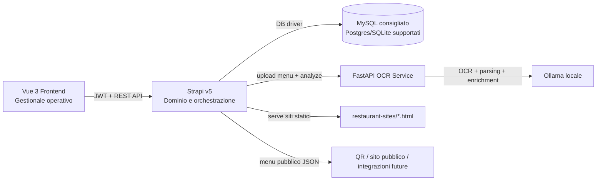

# CMS Restaurant

Piattaforma modulare per la digitalizzazione operativa di un ristorante, costruita come monorepo e composta da:

- un backend `Strapi v5` per dominio, API e logica applicativa;
- un frontend `Vue 3 + Vite` per il gestionale operativo;
- un microservizio `FastAPI` proprietario per OCR e import intelligente dei menu;
- una cartella `restaurant-sites/` che raccoglie micrositi HTML generati o prototipali.

Questo README descrive lo stato reale del repository rilevato il `21 aprile 2026`: distingue cio che e gia implementato da cio che oggi e solo una base tecnica o una proposta di roadmap/commercializzazione.

## Executive Summary

Il progetto e gia strutturato come un gestionale verticale per la ristorazione con focus su quattro nuclei operativi:

- presenza digitale del locale;
- gestione menu e import OCR;
- prenotazioni, sala, tavoli e cucina;
- analytics operative e configurazione account.

La base tecnica e buona: il backend contiene modelli di dominio chiari, controlli di ownership per singolo ristoratore, flussi transazionali sulle prenotazioni e sugli ordini, statistiche giornaliere e una pipeline OCR locale pensata per non dipendere da provider AI esterni. In parallelo, il frontend e gia organizzato per ruoli operativi reali (`Prenotazioni`, `Sala`, `Cucina`, `Menu`, `Manager`).

La repo non e ancora un SaaS commerciale completo: il billing ricorrente non e implementato, le integrazioni POS/cassa fiscale sono predisposte ma non finalizzate, e la suite di test automatizzati va consolidata. Proprio per questo, il valore del progetto oggi e doppio: da un lato e gia un prodotto funzionale per diversi flussi core del ristorante; dall'altro e una base solida per evolvere in una piattaforma SaaS italiana ad alta specializzazione.

## Funzionalita chiave gia presenti

### 1. Presenza digitale del ristorante

- Registrazione account ristoratore con raccolta dei coperti estivi e invernali.
- Creazione automatica della configurazione sito (`WebsiteConfig`) associata all'utente.
- Generazione di un placeholder HTML pubblico nella cartella `restaurant-sites/` al momento dell'onboarding.
- Gestione di:
  - nome ristorante;
  - logo;
  - URL pubblico del sito;
  - capienza stagionale.
- Generazione QR code per la fruizione pubblica del menu/sito.
- Esposizione di un endpoint pubblico per il menu JSON del ristorante.

### 2. Gestione menu e catalogo piatti

- CRUD completo degli elementi menu.
- Attributi gia gestiti a livello di dominio:
  - nome piatto;
  - categoria;
  - prezzo;
  - immagine;
  - ingredienti;
  - allergeni;
  - disponibilita.
- Vista frontend per:
  - elenco menu;
  - filtro per categoria;
  - aggiunta manuale di piatti;
  - modifica ed eliminazione.
- Import del menu da PDF o immagine tramite endpoint dedicato.
- Flusso OCR con revisione umana prima della conferma.
- Modalita di import:
  - `append`, per aggiungere nuovi piatti;
  - `replace`, per sostituire il menu esistente.
- Raggruppamento pubblico del menu per categorie, con supporto a immagini e branding del locale.

### 3. OCR intelligente del menu

- Microservizio separato in `ocr-service/`.
- Pipeline ibrida:
  - rasterizzazione PDF con `PyMuPDF`;
  - preprocessing immagine con `OpenCV`;
  - OCR con `PaddleOCR`;
  - ricostruzione layout;
  - parsing strutturato;
  - arricchimento con `Ollama` in locale.
- Endpoint disponibili:
  - `GET /health`;
  - `GET /ready`;
  - `POST /process`.
- Protezione del file input tramite whitelist path (`ALLOWED_INPUT_DIR`).
- Possibilita di warmup dei modelli OCR prima dell'uso reale.

### 4. Ingredienti e disponibilita operativa

- Modulo ingredienti lato gestionale.
- Possibilita di marcare ingredienti come non disponibili.
- Propagazione della non disponibilita ai piatti che dipendono da quell'ingrediente.
- Vista impatto piatto/ingrediente per capire subito cosa viene nascosto o riattivato.

### 5. Prenotazioni

- Creazione prenotazioni da backoffice.
- Creazione prenotazioni da endpoint pubblico dedicato per il sito del ristorante.
- Rate limit dedicato sul canale pubblico.
- Gestione capienza differenziata per stagione:
  - estate;
  - inverno.
- Prevenzione dell'overbooking con logica a slot e meccanismi transazionali.
- State machine gia introdotta nel dominio:
  - `pending`;
  - `confirmed`;
  - `cancelled`;
  - `at_restaurant`;
  - `completed`.
- Flussi operativi reali:
  - accettazione;
  - rifiuto;
  - seating al tavolo;
  - gestione walk-in;
  - apertura automatica dell'ordine collegato.

### 6. Tavoli, sala, cucina e ordini

- Modello `Table` dedicato con controllo di unicita del numero tavolo per ristorante.
- Stato tavolo derivato dall'occupazione.
- Vincolo operativo: un solo ordine attivo per tavolo.
- Apertura ordine da tavolo o da prenotazione/walk-in.
- Aggiunta articoli:
  - dal menu;
  - fuori menu.
- Calcolo totale lato server.
- Modifica o rimozione articoli consentita nelle fasi corrette del flusso.
- State machine sugli item d'ordine:
  - `taken`;
  - `preparing`;
  - `ready`;
  - `served`.
- Doppia vista operativa nel frontend:
  - modalita cameriere;
  - board cucina.
- Checkout e chiusura ordine.
- Astrazione del pagamento con strategy pattern:
  - `simulator` funzionante;
  - `pos` predisposto;
  - `fiscal_register` predisposto.
- Alla chiusura dell'ordine il sistema:
  - libera il tavolo;
  - chiude l'eventuale prenotazione associata;
  - archivia l'ordine;
  - aggiorna le statistiche giornaliere;
  - aggiorna le statistiche lifetime dei piatti.

### 7. Dashboard, analytics e controllo manageriale

- Dashboard frontend con metriche sintetiche su:
  - numero elementi menu;
  - categorie;
  - food vs beverage;
  - ingredienti unici;
  - allergeni;
  - stato della presenza pubblica.
- Archiviazione degli ordini chiusi.
- Statistiche giornaliere aggregate per ristorante:
  - numero ordini;
  - clienti serviti;
  - ricavi;
  - articoli venduti;
  - incidenza walk-in;
  - incidenza prenotazioni.
- Statistiche lifetime per elemento menu:
  - totale ordinato;
  - ricavo generato;
  - primo ordine;
  - ultimo ordine.

### 8. Profilo, account e sicurezza

- Gestione profilo utente.
- Cambio password.
- Eliminazione account.
- Gestione account-level della 2FA:
  - attivazione;
  - conferma;
  - disattivazione;
  - codici di recupero.
- Bootstrap dei permessi custom su `public` e `authenticated`.
- Validazioni per ambienti production:
  - segreti non placeholder;
  - CORS non wildcard;
  - stop al seed demo in produzione;
  - controllo token OCR;
  - warning contro SQLite in produzione.

## Stato attuale: cosa e live e cosa e ancora embrionale

### Live o molto avanzato

- Menu management manuale e via OCR.
- Prenotazioni con controllo capienza stagionale.
- Walk-in, seating e collegamento prenotazione -> ordine.
- Tavoli, ordini sala, board cucina, checkout.
- Dashboard e statistiche operative.
- Gestione sito/brand/QR/menu pubblico.
- OCR locale con Ollama.

### Presente come base tecnica o concept, ma non ancora prodotto finito

- Billing ricorrente: nel frontend esistono pagine come `RenewSub` e `AddPayment`, ma non c'e ancora un backend SaaS completo per abbonamenti, rinnovi, fatturazione o PSP.
- Integrazione POS e cassa fiscale: il codice usa uno strategy pattern corretto, ma oggi la sola strategy pienamente operativa e il simulatore.
- Test automation: nella repo esistono asset per QA visiva e dipendenze come `Playwright`, ma la copertura automatizzata non e ancora consolidata come suite CI/CD completa.
- Website builder avanzato: `restaurant-sites/` contiene HTML generati e prototipi utili, ma non ancora un builder commerciale unificato con template marketplace e publishing versionato.

## Architettura logica



## Stack tecnologico

| Layer | Tecnologie | Ruolo |
| --- | --- | --- |
| Frontend gestionale | `Vue 3`, `Vite 6`, `Vue Router 4`, `Vuex 4`, `@vueuse/head`, `@vueuse/motion` | Interfaccia operativa per manager, sala, cucina e prenotazioni |
| Backend | `Strapi 5.11`, `Node.js 18-22`, `users-permissions`, servizi e controller custom | Dominio, API, autenticazione, regole di business, ownership |
| Database | `MySQL` consigliato, `Postgres` e `SQLite` supportati dal config | Persistenza applicativa |
| OCR service | `FastAPI`, `Uvicorn`, `PyMuPDF`, `OpenCV`, `PaddleOCR`, `Pydantic v2` | Estrazione strutturata del menu da PDF/immagini |
| AI locale | `Ollama` con modello `qwen2.5:7b` di default | Arricchimento e normalizzazione dei risultati OCR |
| Email / hardening | `Nodemailer`, env validation custom, production checks | Notifiche e guardrail runtime |
| QA / documentazione | `ADR`, screenshot di test, dipendenza `Playwright` | Tracciamento decisioni e base per quality engineering |

## Metodo di sviluppo e principi ingegneristici

- **Monorepo modulare**: backend, frontend, OCR e siti statici sono separati ma coordinati, utile per mantenere confini chiari tra dominio, UI e servizi specializzati.
- **API-first**: il backend Strapi espone endpoint custom per menu, prenotazioni, ordini, tavoli e account, quindi il prodotto e gia impostato come piattaforma integrabile.
- **Decisioni architetturali documentate**: in `docs/adr/` sono presenti almeno due ADR gia accettate per prenotazioni e ordini, segnale di maturita progettuale.
- **Integrita del dato**: ordini e prenotazioni usano state machine, lock versioning, retry su deadlock, calcolo totale server-side e flussi transazionali.
- **Isolamento della AI**: l'import del menu non e stato innestato in modo fragile nel backend, ma isolato in un microservizio specializzato.
- **Ownership per tenant**: gli oggetti critici sono filtrati e validati rispetto all'utente autenticato, coerente con un futuro SaaS multi-tenant.
- **Hardening progressivo**: ci sono controlli specifici per produzione, variabili d'ambiente, CORS, seed e segreti.
- **Approccio role-based UX**: la UI segue i flussi del ristorante reale, non un pannello CMS generico.

## Mappa concettuale dell'albero del progetto

L'albero sotto e volutamente concettuale: mostra la struttura rilevante del prodotto e omette cartelle pesanti o generate automaticamente come `node_modules/` e il dettaglio completo di `strapi/public/uploads/`.

```text
cms_restaurant/
|-- docs/
|   `-- adr/
|       |-- 0001-reservations-system.md
|       `-- 0002-orders-system.md
|-- ocr-service/
|   |-- app/
|   |   |-- api/
|   |   |-- layout/
|   |   |-- models/
|   |   |-- ocr/
|   |   |-- ollama/
|   |   |-- preprocessing/
|   |   `-- utils/
|   |-- scripts/
|   |-- .env.example
|   |-- README.md
|   `-- requirements.txt
|-- restaurant-sites/
|   `-- *.html
|-- strapi/
|   |-- config/
|   |-- src/
|   |   |-- api/
|   |   |   |-- account/
|   |   |   |-- element/
|   |   |   |-- ingredient/
|   |   |   |-- menu/
|   |   |   |-- menu-element-stat/
|   |   |   |-- order/
|   |   |   |-- order-item/
|   |   |   |-- order-archive/
|   |   |   |-- reservation/
|   |   |   |-- restaurant-daily-stat/
|   |   |   |-- table/
|   |   |   `-- website-config/
|   |   |-- extensions/
|   |   |-- middlewares/
|   |   |-- services/
|   |   `-- utils/
|   |-- public/
|   |   `-- uploads/
|   |-- .env.example
|   |-- package.json
|   `-- README.md
|-- test-screens/
|-- test-screenshots/
|-- vuejs/
|   `-- frontend/
|       |-- public/
|       |-- src/
|       |   |-- assets/
|       |   |-- components/
|       |   |-- Layouts/
|       |   |-- Pages/
|       |   |-- router/
|       |   |-- main.js
|       |   `-- store.js
|       |-- index.html
|       |-- package.json
|       |-- README.md
|       `-- vite.config.js
|-- AGENTS.md
|-- CLAUDE.md
|-- GEMINI.md
`-- package.json
```

## Installazione da zero e avvio in locale

Le istruzioni sotto spiegano come preparare l'ambiente locale da zero. Non eseguono nulla automaticamente: servono come guida operativa per chi clona il progetto per la prima volta.

### 1. Scarica i prerequisiti

Installa manualmente:

- `Git`: <https://git-scm.com/downloads>
- `Node.js 20 LTS` consigliato: <https://nodejs.org/>
  - nota: il backend dichiara supporto `>=18 <=22`, ma `20 LTS` e la scelta piu equilibrata.
- `Python 3.10+`: <https://www.python.org/downloads/>
  - per ridurre attriti con OCR e dipendenze native, `Python 3.10` o `3.11` sono le opzioni piu prudenti.
- `MySQL 8 Community Server`: <https://dev.mysql.com/downloads/mysql/>
- `Ollama`: <https://ollama.com/download>

Consigliato ma non obbligatorio:

- `MySQL Workbench` o un client SQL equivalente.
- Un terminale `PowerShell` aggiornato.
- `Visual Studio Build Tools` solo se il tuo ambiente Windows dovesse richiederli per pacchetti Python nativi.

### 2. Clona la repository

```powershell
git clone <URL-DELLA-REPOSITORY> cms_restaurant
cd cms_restaurant
```

### 3. Prepara il database MySQL

Il progetto nasce con `MySQL` come default applicativo. Per questo, per la prima installazione locale e meglio restare allineati a questa scelta.

#### Opzione consigliata

1. Installa `MySQL Server 8`.
2. Avvia il server locale.
3. Crea database e utente dedicati.

Esempio SQL:

```sql
CREATE DATABASE `cms-restaurants`
  CHARACTER SET utf8mb4
  COLLATE utf8mb4_unicode_ci;

CREATE USER 'cms-admin'@'localhost' IDENTIFIED BY 'SostituisciConPasswordSicura';
GRANT ALL PRIVILEGES ON `cms-restaurants`.* TO 'cms-admin'@'localhost';
FLUSH PRIVILEGES;
```

#### Opzione alternativa

Il backend supporta anche `Postgres` e `SQLite` tramite configurazione, ma:

- `MySQL` resta la scelta piu coerente con la configurazione attuale della repo;
- `SQLite` e utile solo per smoke test rapidi, non per simulare in modo credibile la concorrenza di prenotazioni e ordini;
- il codice stesso scoraggia `SQLite` in produzione.

### 4. Configura le variabili d'ambiente

#### 4.1 Backend Strapi

Copia il file example:

```powershell
Copy-Item strapi\.env.example strapi\.env
```

Poi apri `strapi/.env` e imposta almeno:

- segreti applicativi:
  - `APP_KEYS`
  - `API_TOKEN_SALT`
  - `ADMIN_JWT_SECRET`
  - `TRANSFER_TOKEN_SALT`
  - `JWT_SECRET`
- database:
  - `DATABASE_CLIENT=mysql`
  - `DATABASE_NAME=cms-restaurants`
  - `DATABASE_HOST=127.0.0.1`
  - `DATABASE_PORT=3306`
  - `DATABASE_USERNAME=cms-admin`
  - `DATABASE_PASSWORD=<la tua password>`
- CORS:
  - `CORS_ORIGIN=http://localhost:5174`
- OCR:
  - `OCR_SERVICE_URL=http://127.0.0.1:8001`
  - `MENU_UPLOAD_DIR=D:\percorso\assoluto\cms_restaurant\strapi\.menu-upload`

Note importanti:

- `MENU_UPLOAD_DIR` e il punto di incontro tra Strapi e il microservizio OCR: deve essere un path assoluto reale e leggibile.
- Se vuoi usare il seed demo, prima del primo avvio di Strapi imposta:
  - `SEED_DEMO_DATA=true`
  - `DEMO_USER_EMAIL=demo@restaurant.com`
  - `DEMO_USER_PASSWORD=<password demo>`

#### 4.2 Microservizio OCR

Copia il file example:

```powershell
Copy-Item ocr-service\.env.example ocr-service\.env
```

Poi apri `ocr-service/.env` e allinea almeno:

- `HOST=127.0.0.1`
- `PORT=8001`
- `OLLAMA_URL=http://localhost:11434`
- `OLLAMA_MODEL=qwen2.5:7b`
- `OCR_LANG=it`
- `ALLOWED_INPUT_DIR=D:\percorso\assoluto\cms_restaurant\strapi\.menu-upload`

Regola chiave:

- `ALLOWED_INPUT_DIR` deve coincidere con `MENU_UPLOAD_DIR` di Strapi.
- Se i due path non coincidono, il servizio OCR rifiutera il file con errore `403 path not allowed`.

Sicurezza in locale:

- per sviluppo locale puoi lasciare il token interno disattivato come nell'example (`REQUIRE_INTERNAL_API_TOKEN=false`);
- per ambienti condivisi o piu vicini alla produzione conviene impostare un segreto condiviso tra:
  - `OCR_SERVICE_INTERNAL_TOKEN` su Strapi;
  - `INTERNAL_API_TOKEN` su OCR.

#### 4.3 Frontend Vue

Nel frontend non e presente un `.env.example`, quindi crea manualmente `vuejs/frontend/.env` con almeno:

```env
VITE_API_BASE_URL=http://localhost:1337
```

Se backend e frontend girano su host o porte diverse, aggiorna questo valore di conseguenza.

### 5. Installa le dipendenze del progetto

La repo non espone oggi un orchestratore unico root-level: le dipendenze vanno installate per ogni sub-progetto.

#### 5.1 Backend Strapi

```powershell
cd strapi
npm install
cd ..
```

#### 5.2 Frontend Vue

```powershell
cd vuejs\frontend
npm install
cd ..\..
```

#### 5.3 OCR service Python

```powershell
cd ocr-service
python -m venv .venv
.\.venv\Scripts\Activate.ps1
python -m pip install --upgrade pip
pip install -r requirements.txt
python scripts\warmup.py
cd ..
```

Note:

- `warmup.py` e opzionale ma fortemente consigliato: al primo avvio `PaddleOCR` scarica i modelli, quindi fare il warmup prima evita ritardi in runtime.
- Se PowerShell blocca l'attivazione del virtualenv, usa una policy temporanea per la sola sessione:

```powershell
Set-ExecutionPolicy -Scope Process Bypass
```

- Su macOS/Linux l'attivazione del virtualenv diventa:

```bash
source .venv/bin/activate
```

### 6. Prepara Ollama e il modello locale

Installa `Ollama`, poi scarica il modello previsto dall'example:

```powershell
ollama pull qwen2.5:7b
```

Se il servizio Ollama non parte automaticamente sul tuo sistema, avvialo:

```powershell
ollama serve
```

### 7. Avvia i servizi locali

Usa terminali separati.

#### Terminale 1 - Ollama

```powershell
ollama serve
```

Se il daemon e gia attivo, puoi saltare questo passaggio.

#### Terminale 2 - OCR service

```powershell
cd ocr-service
.\.venv\Scripts\Activate.ps1
uvicorn app.main:app --host 127.0.0.1 --port 8001
```

Check utili:

- liveness: `http://127.0.0.1:8001/health`
- readiness: `http://127.0.0.1:8001/ready`

#### Terminale 3 - Strapi

```powershell
cd strapi
npm run dev
```

Alla prima esecuzione:

- Strapi inizializzera lo schema sul database;
- potresti dover completare il primo setup admin dal browser;
- se `SEED_DEMO_DATA=true`, il seed demo verra applicato solo se hai definito anche `DEMO_USER_PASSWORD`.

#### Terminale 4 - Frontend

```powershell
cd vuejs\frontend
npm run dev
```

### 8. URL locali attesi

- Frontend gestionale: `http://localhost:5174`
- Backend Strapi: `http://localhost:1337`
- Admin Strapi: `http://localhost:1337/admin`
- OCR health: `http://127.0.0.1:8001/health`
- OCR ready: `http://127.0.0.1:8001/ready`

### 9. Allineamenti che vanno verificati sempre

- `VITE_API_BASE_URL` del frontend deve puntare a Strapi.
- `OCR_SERVICE_URL` di Strapi deve puntare all'OCR service.
- `MENU_UPLOAD_DIR` di Strapi deve coincidere con `ALLOWED_INPUT_DIR` dell'OCR.
- `CORS_ORIGIN` di Strapi deve includere `http://localhost:5174`.
- `Ollama` deve avere il modello richiesto gia scaricato.

### 10. Build di verifica consigliate

Dopo l'installazione iniziale, prima di iniziare sviluppo attivo conviene eseguire almeno:

```powershell
cd strapi
npm run build

cd ..\vuejs\frontend
npm run build
```

Per il microservizio OCR non c'e una build separata: la verifica passa da `GET /health`, `GET /ready` e da una prova reale di analisi menu.

## Approccio commerciale consigliato per trasformarlo in SaaS

### Benchmark di mercato osservato

Verifica benchmark effettuata il `21 aprile 2026`. I prezzi pubblici variano in base a paese, piano mensile/annuale e componenti variabili, ma la fascia competitiva e sufficientemente chiara [1][2][3][4].

| Piattaforma | Fascia prezzo pubblica osservata | Modello | Lettura strategica |
| --- | --- | --- | --- |
| OpenTable | da `$149/mese` fino a `$499/mese`, con fee per cover in vari casi [1] | abbonamento + fee variabili | molto forte sul network, ma costoso per indipendenti e meno prevedibile |
| Tableo | free fino a `100` covers/mese, poi circa `EUR 49.17`, `EUR 82.50`, `EUR 140.83` in piani annuali [2] | freemium + abbonamento | fascia media accessibile, focus prenotazioni/operations |
| Hostme | circa `EUR 109/mese` e `EUR 169/mese` in area EU [3] | flat fee mensile | pricing semplice, orientato a reservations + operations |
| Wix | da circa `$17.77/mese` a `$39.77/mese` per siti business standard [4] | builder sito | baseline utile solo per la parte vetrina, non per il gestionale operativo |

### Cosa suggerisce il benchmark

- Il vostro prodotto non deve essere prezzato come un semplice website builder.
- Allo stesso tempo, per il mercato italiano indipendente conviene evitare il modello a commissione/per-cover tipico delle piattaforme piu aggressive.
- La posizione piu interessante e stare:
  - sopra il puro sito vetrina;
  - sotto le suite premium internazionali;
  - con prezzo piatto e comprensibile.

### Proposta concreta di abbonamento mensile

#### Piano 1 - Start

- **Prezzo suggerito**: `EUR 39/mese`
- **Target**: piccoli ristoranti, pizzerie, bistrot, locali mono-sede che vogliono uscire da carta + WhatsApp + Excel
- **Include**:
  - scheda ristorante e branding base;
  - sito pubblico/microsito collegato;
  - menu digitale con immagini, categorie, allergeni;
  - QR code;
  - prenotazioni online;
  - gestione capienza estate/inverno;
  - dashboard base;
  - supporto email.

#### Piano 2 - Operativo

- **Prezzo suggerito**: `EUR 89/mese`
- **Target**: ristoranti che vogliono un vero gestionale operativo unico
- **Include tutto lo Start**, piu:
  - tavoli e occupazione sala;
  - ordini sala/cucina;
  - board cucina;
  - walk-in e seating;
  - import OCR del menu;
  - gestione ingredienti non disponibili;
  - analytics operative;
  - supporto prioritario.

### Costi una tantum consigliati

- **Onboarding e setup iniziale**: `EUR 149 - 249`
  - utile per coprire configurazione, import dati iniziale, training e posizionare il prodotto come servizio professionale e non commodity.

### Servizio opzionale separato: creazione sito web personalizzato

Questo va venduto separatamente dal SaaS, perche richiede lavoro creativo, copy, branding e cicli approvativi.

#### Pacchetto Web Smart

- **Prezzo suggerito**: `EUR 1.200 - 1.800` una tantum
- **Adatto a**: ristorante singolo che vuole una presenza professionale e veloce
- **Include**:
  - home brandizzata;
  - sezione menu collegata al gestionale;
  - pagina contatti;
  - integrazione prenotazioni;
  - adattamento mobile;
  - SEO base;
  - analytics base.

#### Pacchetto Web Premium

- **Prezzo suggerito**: `EUR 2.500 - 4.500` una tantum
- **Adatto a**: locali con forte identita, storytelling o bisogno commerciale piu alto
- **Include**:
  - design su misura;
  - piu pagine;
  - copywriting strutturato;
  - galleria media;
  - eventi/degustazioni;
  - blog o news;
  - SEO avanzata;
  - tracciamenti marketing;
  - eventuale multilingua iniziale.

#### Manutenzione opzionale sito custom

- **Prezzo suggerito**: `EUR 25 - 49/mese`
- **Include**:
  - piccole modifiche contenutistiche;
  - aggiornamenti periodici;
  - supporto tecnico leggero;
  - monitoraggio uptime/form.

### Perche questa proposta ha senso

- `EUR 39/mese` si colloca sopra il puro sito vetrina ma resta accessibile.
- `EUR 89/mese` e ancora nettamente sotto molte suite verticali internazionali, ma valorizza la parte operativa reale del vostro prodotto.
- Il sito personalizzato separato evita di sottostimare il lavoro progettuale.
- L'assenza di fee per cover puo diventare un vantaggio competitivo forte rispetto a modelli piu opachi o variabili [1][3].

## Analisi strategica e roadmap prodotto 2025-2026

L'indagine di mercato e i materiali di settore convergono su un punto: nel 2025-2026 i ristoratori non cercano un altro pannello per prendere prenotazioni, ma un sistema che riduca sprechi, errori amministrativi, caos operativo e frammentazione tra canali [5][6][7][8][9][10][11].

### Fase 1 - Controllo finanziario e fiscale

Priorita massima, perche impatta direttamente marginalita e sopravvivenza del locale.

- **Distinta base analitica per piatto**
  - grammi, resa, sfridi, costo teorico per porzione.
- **Food cost passivo/consuntivo**
  - confronto tra consumo teorico da vendite e stock reale.
- **Movimenti di magazzino e inventario**
  - carichi, scarichi, rettifiche, scarti, uso interno.
- **Modulo sprechi e sfridi**
  - causale, quantita, reparto, responsabile, costo stimato.
- **Riconciliazione buoni pasto**
  - selezione emittente, fee per circuito, netto atteso, pre-fattura automatica [8].
- **Gestione fiscale mance 2025**
  - supporto al regime con imposta sostitutiva al `5%`, soglie e reportistica per payroll/amministrazione [7].
- **Scontrino commerciale via API/web procedure**
  - per locali che vogliono ridurre dipendenza da hardware dedicato.

### Fase 2 - Efficienza operativa e AI

Qui il gestionale smette di essere reattivo e diventa proattivo.

- **Menu engineering**
  - classificazione `Star / Plowhorse / Puzzle / Dog`;
  - evidenza dei piatti che generano ricavi ma non profitto.
- **Forecast della domanda**
  - prenotazioni, vendite storiche, meteo, eventi locali, stagionalita [10].
- **AI scheduling dei turni**
  - suggerimenti di copertura sala/cucina in base ai picchi previsti.
- **KDS avanzato con sequencing**
  - sincronizzazione dei tempi di uscita dei piatti.
- **Load balancing tra stazioni**
  - redistribuzione del carico cucina.
- **Computer vision per inventario**
  - filone ad alto potenziale per contare stock e ridurre errori manuali [9].
- **Offline-first / modalita degradata**
  - continuita minima di servizio anche con connettivita assente.

### Fase 3 - Esperienza cliente, omnicanalita e marketing

Questa fase trasforma il prodotto in motore di crescita, non solo di efficienza.

- **Menu unificato sincronizzato**
  - un solo punto di verita per sala, sito proprietario e delivery.
- **Hub integrazione delivery**
  - riduzione del "tablet hell" e centralizzazione ordini.
- **Click and collect / delivery proprietario**
  - per riportare margine sul canale diretto.
- **Kiosk e self-order**
  - utile per food court, take away e locali ad alto flusso.
- **CRM ospite**
  - storico visite, preferenze, note, ritorno cliente.
- **Loyalty e campagne riattivazione**
  - coupon, reminder, target per clienti dormienti.
- **Reputation hub**
  - aggregazione recensioni Google, TripAdvisor, Facebook.
- **Sentiment analysis + AI reply draft**
  - tempi piu rapidi e tono piu coerente nelle risposte pubbliche [5].

### Fase 4 - Espansione piattaforma

Fase successiva, da affrontare quando il core economico-operativo e stabile.

- multi-sede;
- dashboard comparativa tra sedi;
- API partner documentate;
- ruoli e permessi piu granulari;
- reportistica export per commercialista/consulente;
- motore template per siti ristorante versionati e pubblicabili.

## Migliorie ingegneristiche consigliate

Per rendere il progetto piu forte anche lato delivery tecnico:

- introdurre una suite E2E stabile su prenotazioni, ordini e OCR review;
- aggiungere CI con build frontend/backend e smoke test OCR;
- preparare `docker-compose` per onboarding tecnico piu rapido;
- centralizzare logging applicativo e tracing per le chiamate Strapi -> OCR;
- definire una strategia di backup/restore e seed ambienti demo;
- aggiungere fixture realistiche per ristorante mono-sede e medio-volume;
- introdurre test di concorrenza sulle prenotazioni.

## Fonti

Le fonti sotto sono state usate per la sezione di benchmark, pricing e roadmap strategica. Dove i prezzi dipendono da paese o piano annuale/mensile, nel README sono stati riportati come benchmark di fascia e non come listino contrattuale definitivo.

- [1] OpenTable Plans & Pricing: <https://www.opentable.com/restaurant-solutions/plans/>
- [2] Tableo Pricing: <https://tableo.com/es-precio/>
- [3] Hostme Pricing EU: <https://www.hostmeapp.com/pricing/eu>
- [4] Wix Plans: <https://www.wix.com/plans>
- [5] FIPE, transizione digitale di bar e ristoranti: <https://www.fipe.it/2025/10/18/comunicazione/innovazione-ad-host-il-punto-sulla-transizione-digitale-di-bar-e-ristoranti/>
- [6] FIPE, spreco alimentare e riduzione scarti: <https://www.fipe.it/2025/04/11/strumenti-per-le-imprese/spreco-alimentare/non-solo-doggy-bag-ingredienti-porzioni-cotture-e-le-strategie-dei-ristoranti-contro-gli-sprechi/>
- [7] Beneggi & Associati, detassazione delle mance dal 2025: <https://beneggiassociati.com/detassazione-delle-mance-nuove-regole-dal-2025/>
- [8] Argentea, buoni pasto digitali nella ristorazione: <https://www.argentea.it/2025/05/27/buoni-pasto-digitali-cosa-deve-fare-un-ristorante-al-passo-coi-tempi/>
- [9] Food On Demand, AI inventory counting: <https://foodondemand.com/10212025/ai-steps-in-to-automate-one-of-restaurants-most-dreaded-tasks/>
- [10] Food On Demand, AI e decision intelligence nella ristorazione: <https://foodondemand.com/05282025/how-restaurants-can-move-from-ai-hype-to-real-results/>
- [11] FIPE Rapporto Ristorazione 2025: <https://www.fipe.it/2025/04/09/rapporto-ristorazione-2025/>
